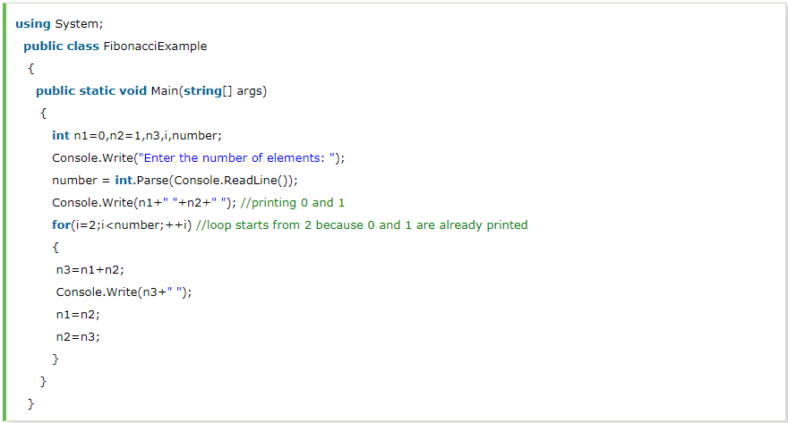
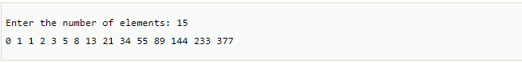

# Fibonacci Series in C\#

In case of fibonacci series, next number is the sum of previous two numbers for example 0, 1, 1, 2, 3, 5, 8, 13, 21 etc. The first two numbers of fibonacci series are 0 and 1.

## Let's see the fibonacci series program in C\#.Output:-

