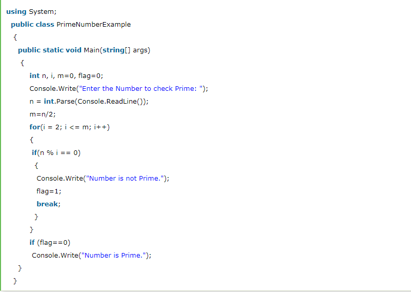
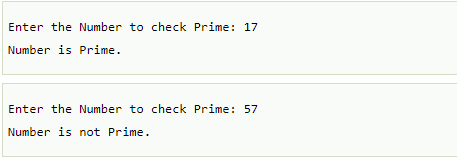

# Prime Number Program in C\#

Prime number is a number that is greater than 1 and divided by 1 or itself. In other words, prime numbers can't be divided by other numbers than itself or 1. For example 2, 3, 5, 7, 11, 13, 17, 19, 23.... are the prime numbers.

Let's see the prime number program in C\#. In this C\# program, we will take an input from the user and check whether the number is prime or not.

## Output:

