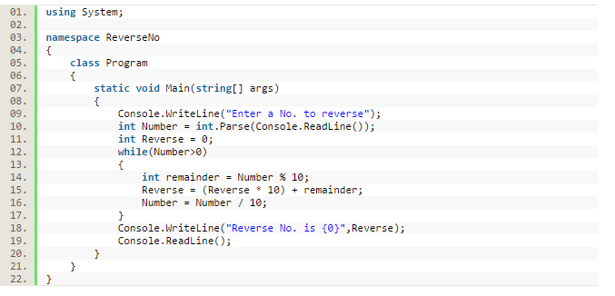
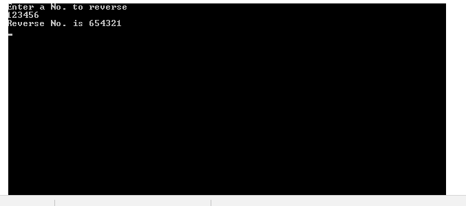

# Reverse a Number in C\#

## Roof work :-

## Step 1

For example no is Number=468

reminder=8

Reverse=8

Number=46

## Step 2

Number=46

reminder=6

Reverse=86

Number=4

## Step 3

Number=4

reminder=4

Reverse=864

