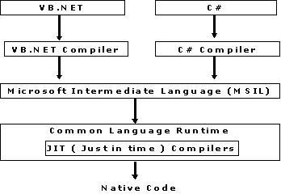

# CLR

##         ****

## Functions of the CLR

* Convert code into CLI.
* Exception handling
* Type safety
* Memory management \(using the Garbage Collector\)
* Security
* Improved performance
* Language independency
* Platform independency
* Architecture independency

## **Components of the CLR**

* **Class Loader:-** Used to load all classes at run time.
* **MSIL to Native code:-** The Just In Time \(JTI\) compiler will convert MSIL code into native code.
* **Code Manager:-** It manages the code at run time.
* **Garbage Collector:-** It manages the memory. Collect all unused objects and deallocate them to reduce memory.
* **Thread Support:-** It supports multithreading of our application.
* **Exception Handler:-** It handles exceptions at run time.

