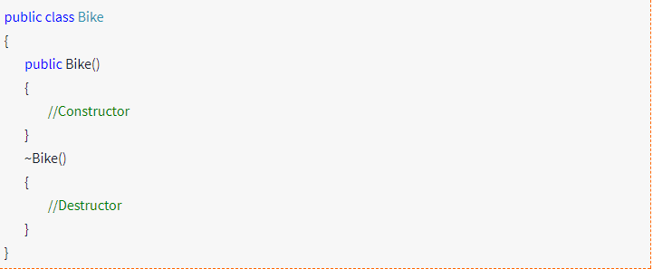

# Destructors

Since garbage cleanup is automatic system, framework will free the objects that are no longer in use BUT there may be times where we need to do some manual cleanup. In this case we can use Destructor, which is used to destroy the objects that we no longer want to use.

A destructor method called once an object is disposed, can be used to cleanup resources used by the object. Destructors don’t look very much like other methods.

Here is an example of a destructor for our Bike class:

Once the class object is instantiated,\_Constructor \_will be called and when object is collected by the garbage collector,

\_Destructor \_method will be called.

