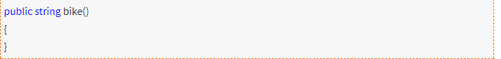
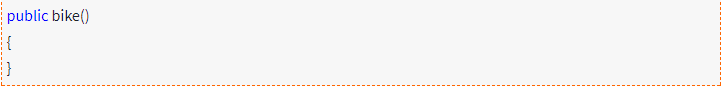
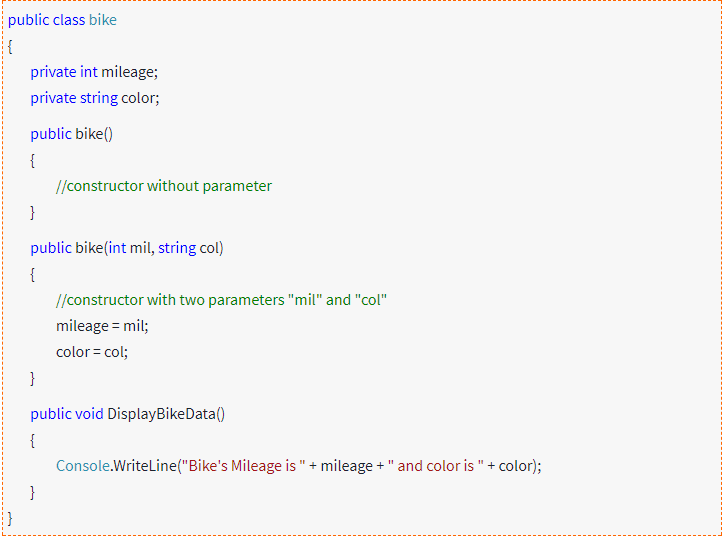

# What is constructor

## **Constructor:-**

**Constructors** are special methods, used when instantiating a class. A constructor can never return anything, which is why you don’t have to define a return type for it.

## **Default Constructor :**

A **constructor** without any parameters is called as default constructor. Drawback of default constructor is every instance of the class will be initialized to same values and it is not possible to initialize each instance of the class to different values.

### Parameterized Constructor : -

A **constructor** with at least one parameter is called as **parameterized constructor**. Advantage of **parameterized** **constructor** is you can initialize each instance of the class to different values.

### Example for Parameterized Constructor:-

```text
using System;
namespace ProgramCall
{
    class Test1
    {
        //Private fields of class
        int A, B;

    //default Constructor  
    public Test1()  
    {  
        A = 10;  
        B = 20;  
    }  

    //Paremetrized Constructor  
    public Test1(int X, int Y)  
    {  
        A = X;  
        B = Y;  
    }  

    //Method to print  
    public void Print()  
    {  
        Console.WriteLine("A  =  {0} tB  =  {1}", A, B);  
    }        

}  

class MainClass  
{  
    static void Main()  
    {  

        Test1 T1 = new Test1();  //Default Constructor is called  
        Test1 T2 = new Test1(80, 40); //Parameterized Constructor is called          
        T1.Print();  
        T2.Print();  
        Console.Read();         
    }  
}
```

}

Output

A = 10 B = 20  
A = 80 B = 40

### Ex-



A simple constructor\(without parameters\) can be defined like this:



And here is the example of parameterized constructor:



### Key points to note about constructor are:

* If no **constructor** defined then the CLR\(Common Language Runtime\) will provide an implicit **constructor** which is known as a

  _**Default Constructor**_.

* **Constructor** doesn’t return a value.
* **Constructors** can be overloaded.
* A class can have any number of **constructors** and they vary with the number of arguments that are passed, which is they should have different parameters or signatures.
* We don’t use references or pointers on **constructors** because their addresses cannot be taken.
* **Constructor** doesn’t be declared with the \_virtual \_keyword.

