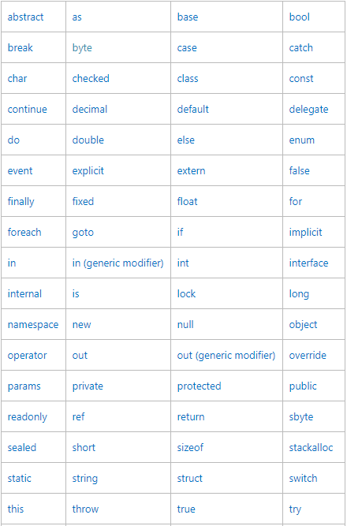
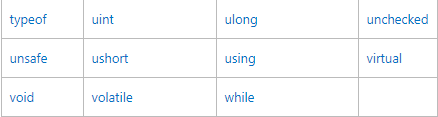
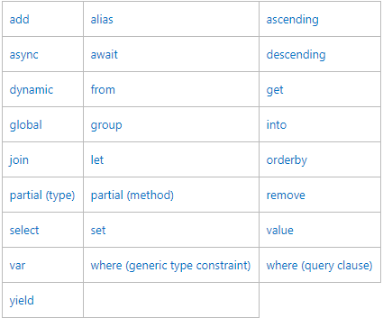

# Reserved and Contextual Keywords in c\#

## Reserved and Contextual Keywords in c\#:-

* Keywords are predefined, reserved identifiers that have special meanings to the compiler. 
* They cannot be used as identifiers in your program unless they include@ as a prefix. 
* For example,@ if is a valid identifier but if is not because if is a keyword.
* The first table in this topic lists keywords that are reserved identifiers in any part of a C\# program. 
* The second table in this topic lists the contextual keywords in C\#. 
* Contextual keywords have special meaning only in a limited program context and can be used as identifiers outside that context. 
* Generally, as new keywords are added to the C\# language, they are added as contextual keywords in order to avoid breaking programs written in earlier versions.

## Contextual Keyword

* A contextual keyword is used to provide a specific meaning in the code, but it is not a reserved word in C\#. 
* Some contextual keywords, such as partial and where, have special meanings in two or more contexts.

