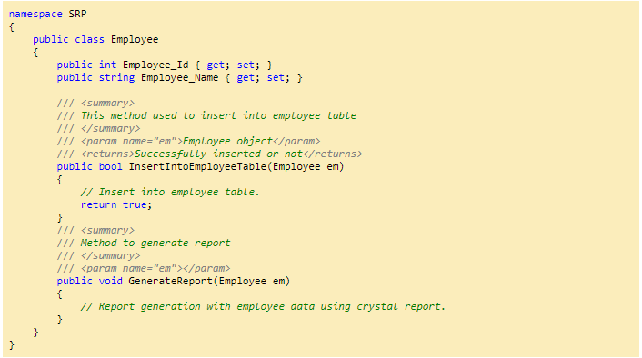
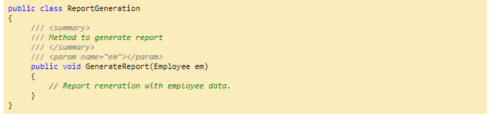
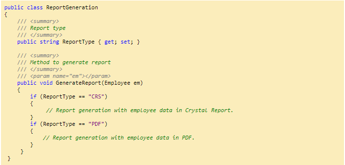
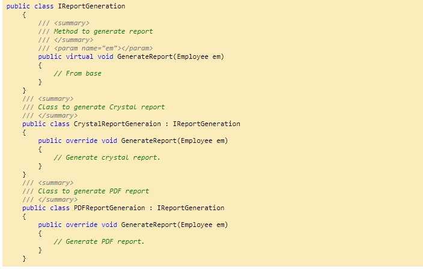
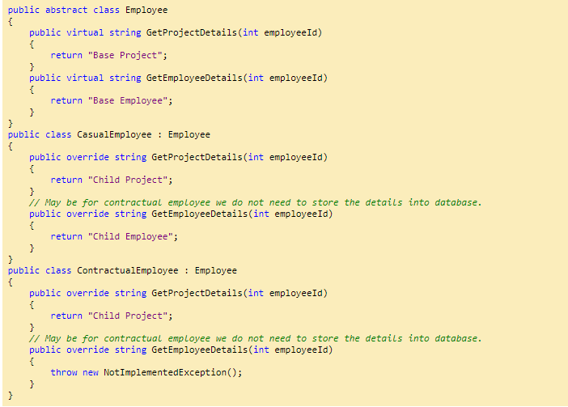
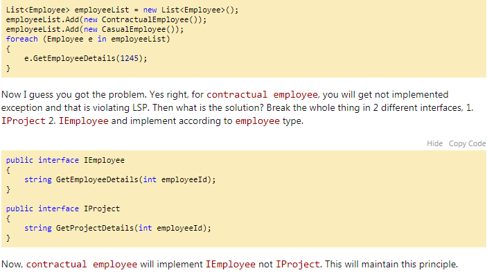
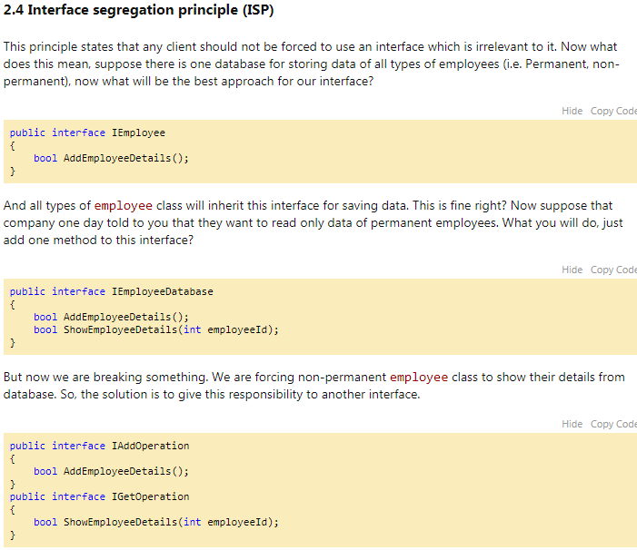
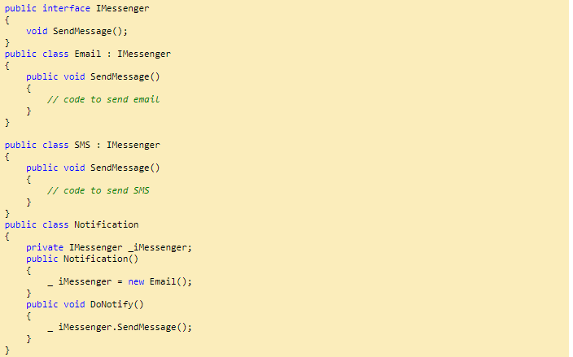
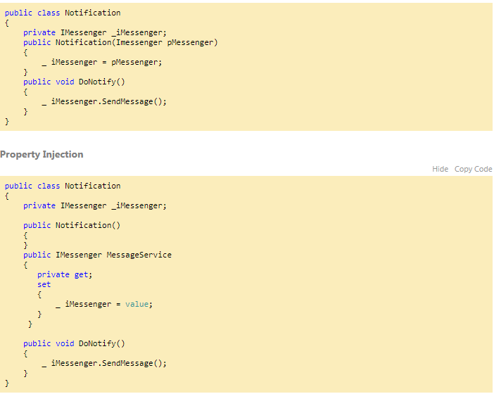
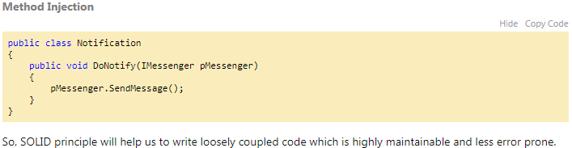

# SOLID Principle with C\#

SOLID is basically 5 principles, which will help to create a good software architecture. You can see that all design patterns are based on these principles. SOLID is basically an acronym of the following:

* **S** _is single responsibility principle \(SRP\)_
* **O** _stands for open closed principle \(OCP\)_
* **L** _Liskov substitution principle \(LSP\)_
* **I** _interface segregation principle \(ISP\)_
* **D** _Dependency injection principle \(DIP\)_

I believe that with pictures, with examples, an article will be more approachable and understandable.

## 1.1 Single responsibility principle \(SRP\)

* A class should take one responsibility and there should be one reason to change that class. 
* Now what does that mean? I want to share one picture to give a clear idea about this.
* Now see this tool is a combination of so many different tools like knife, nail cutter, screw driver, etc. So will you want to buy this tool? I don’t think so. 
* Because there is a problem with this tool, if you want to add any other tool to it, then you need to change the base and that is not good. 
* This is a bad architecture to introduce into any system.
* It will be better if nail cutter can only be used to cut the nail or knife can only be used to cut vegetables.
* Now I want to give one C\# example on this principle:

* ‘`Employee`’ class is taking 2 responsibilities, one is to take responsibility of employee database operation and another one is  to generate employee report.
* `Employee`class should not take the report generation responsibility because suppose some days after your customer asked you to give a facility to generate the report in Excel or any other reporting format, then this class will need to be changed and that is not good.
* So according to SRP, one class should take one responsibility so we should write one different class for report generation, so that any change in report generation should not affect the ‘`Employee`’ class.

## 2.2 Open closed principle \(OCP\)

Now take the same ‘`ReportGeneration`’ class as an example of this principle. Can you guess what is the problem with the below class!!

Brilliant!! Yes you are right, too much ‘`If`’ clauses are there and if we want to introduce another new report type like ‘

`Excel`’, then you need to write another ‘`if`’. This class should be open for extension but closed for modification. But how to do that!!

So if you want to introduce a new report type, then just inherit from`IReportGeneration`. So`IReportGeneration`is open for extension but closed for modification.

## 2.3 Liskov substitution principle \(LSP\)

* This principle is simple but very important to understand. 
* Child class should not break parent class’s type definition and behavior. 
* Now what is the meaning of this!! Ok let me take the same`employee`example to make you understand this principle. 
* Check the below picture.`Employee`is a parent class and`Casual`and`Contractual employee`are the child classes, inhering from`employee`class.

Now see the below code:

Up to this is fine right? Now, check the below code and it will violate the LSP principle.

And non-permanent`employee`will implement only`IAddOperation`and permanent`employee`will implement both the interface.

## 2.5Dependency inversion principle \(DIP\)

* This principle tells you not to write any tightly coupled code because that is a nightmare to maintain when the application is growing bigger and bigger.
* If a class depends on another class, then we need to change one class if something changes in that dependent class.
* We should always try to write loosely coupled class.Suppose there is one notification system after saving some details into database.

* Now`Notification`class totally depends on`Email`class, because it only sends one type of notification. 
* If we want to introduce any other like SMS then? We need to change the notification system also. And this is called tightly coupled. 
* What can we do to make it loosely coupled? Ok, check the following implementation.

Still`Notification`class depends on`Email`class. Now, we can use dependency injection so that we can make it loosely coupled. There are 3 types to DI, Constructor injection, Property injection and method injection.

### Constructor Injection

