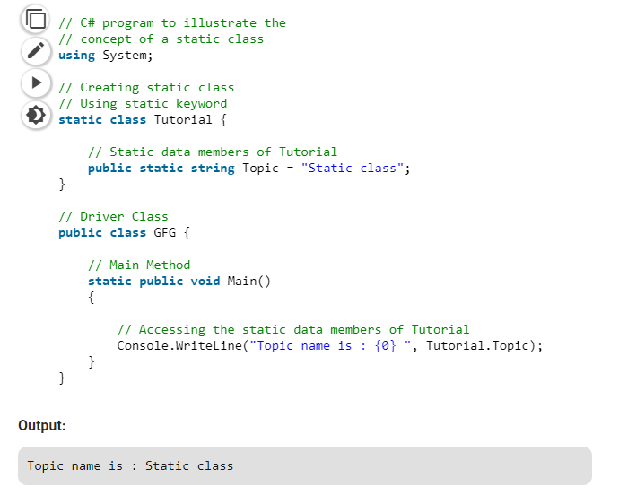

# Static Class

A static class is declared with the help of_static\_keyword. A static class can only contain static data members, static methods, and a static constructor. It is not allowed to create objects of the static class. Static classes are\[_**sealed**\_\] means one cannot inherit a static class from another class.

## **Example:**

