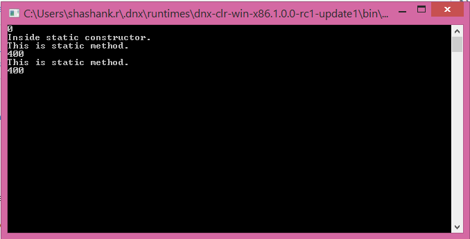
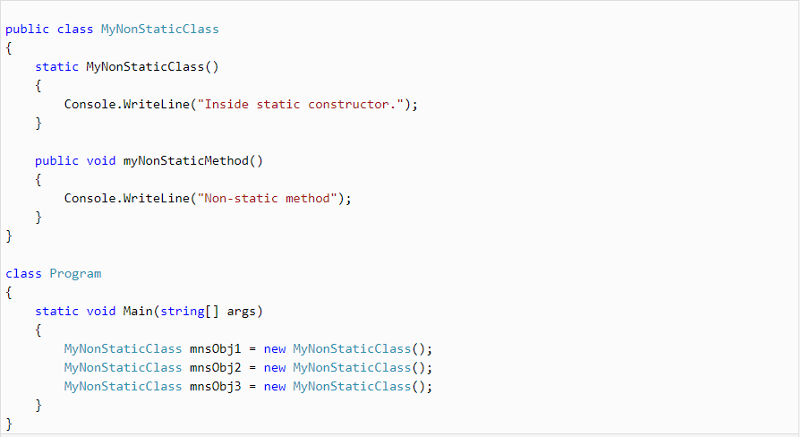

# Static Constructor

A static or non-static class can have a static constructor without any access modifiers like public, private, protected, etc.

A static constructor in a non-static class runs only once when the class is instantiated for the first time.

A static constructor in a static class runs only once when any of its static members accessed for the first time.

## Example: Static Constructor in Static Class

```text
public static class MyStaticClass
{
    public static int myStaticVariable = 0;

    static MyStaticClass()

    {
        Console.WriteLine(myStaticVariable);

        Console.WriteLine("Inside static constructor.");

    }  

    public static void myStaticMethod()

    {

        Console.WriteLine("This is static method.");

        Console.WriteLine(myStaticVariable);
    }

    public static int MyStaticProperty { get; set; }

}

class Program

{

    static void Main(string[] args)
    {

        MyStaticClass.myStaticVariable = 400;

        MyStaticClass.myStaticMethod();// = 300;

        MyStaticClass.myStaticMethod();// = 200;

        MyStaticClass.MyStaticProperty = 400;

        Console.ReadKey();

    }

}
```

## Output :-



## Example: Static constructor in a non-static class

## Output:

**Inside static constructor**

In the above example, we instantiate MyNonStaticClass three times but the static constructor got called only once when it instantiated for the first time.

