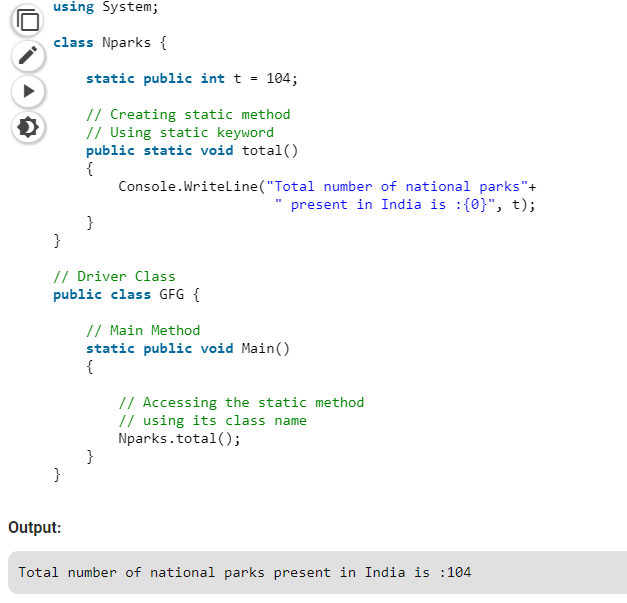

# Static Method

A static method is declared with the help of static keyword. Static methods are accessed with the name of the class. A static method can access static and non-static fields, static fields are directly accessed by the static method without class name whereas non-static fields require objects.

## **Example:**

