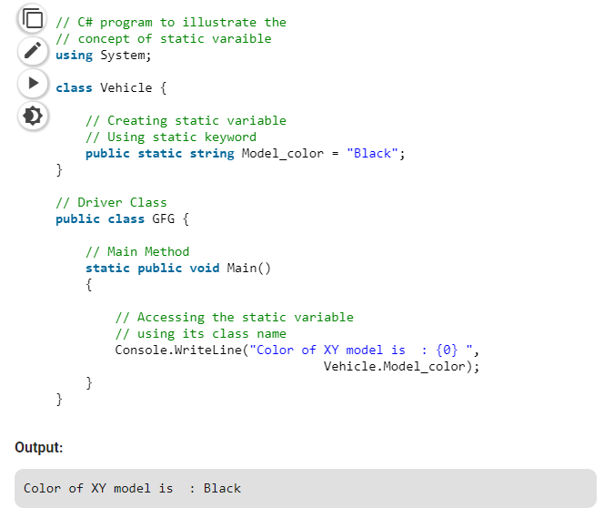

# Static Variable

A static variable is declared with the help of static keyword. When a variable is declared as static, then a single copy of the variable is created and shared among all objects at the class level. Static variables are accessed with the name of the class, they do not require any object for access.

## **Example:**

